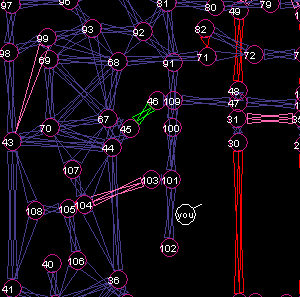
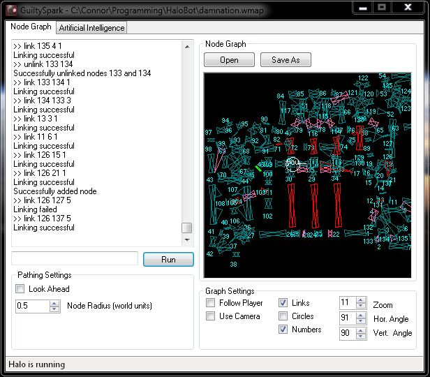

Back in 2010, as a first-year UVic student, I started building [a program that plays Halo](/post/guiltyspark). I wanted to go a step further than the [aimbots](http://www.urbandictionary.com/define.php?term=Aimbot) that already existed for the game, and build something that took over *all* of the player's responsibilities. It needed to be intelligent, and it needed to be mobile.

Mobility was the first thing I tackled. To start off, the user should be able to tell the bot, "walk to this room!", and the bot will determine the shortest path to the target and simulate the combination of key presses required follow it. Then, later on in development, the [script engine](/post/guiltyspark-scripting) (the bot's "brain") would tell the navigation system what to do.

To navigate, the bot needs to know 3 things:
1. Where it is
2. Where it's going
3. Where it's possible to walk (the environment)

As I mentioned in the GuiltySpark introduction, the bot runs as an external process that reads data out of the running game's memory and effects actions by simulating keyboarding and mouse input. Knowing #1 is easy: somewhere in Halo's memory are XYZ coordinates for the player's position. To find the address, I used [Cheat Engine](http://www.cheatengine.org/) to scan for changes (or the lack of changes) in memory after I moved or didn't move the player. Sometimes the information you're looking for is at static addresses that don't change every time the game is run, but sometimes you need to reverse engineer pointers and data structures to consistently get back to it from static locations. Once you know the address of some data you want, you can read it with a system call.

Knowing #3 is more difficult. The collision geometry, which dictates where the player could walk, is stored in a binary space partitioning (BSP) tree. It would be a big job to extract it, so instead I manually created navigation graphs that linked points to each other. A link meant you could walk from one point to another. Eventually, I did reverse engineer the BSP tree to [solve the visibility detection problem](/post/guiltyspark-visibility-detection), but never used it to generate a navigation mesh.

It was an incredibly time consuming task to create these navigation graphs. It involved running the game in one window, with GuiltySpark open beside it, and walking around the map in-game while pressing hotkeys to build the graph. Placing all the points for a medium-sized map usually took a couple hours. You could manually place links and nodes using the GUI's command box:

When it came time for the bot to navigate from point A to point B, I used [A* pathfinding](http://en.wikipedia.org/wiki/A*_search_algorithm) to get the shortest path through the graph. The path following algorithm would then virtually press the W, A, S, D, Ctrl, and Space keys which were bound to the movement controls in-game. It took into account the direction the bot was facing, so that it could walk backwards. Separating the looking direction from the walking direction was important for the eventual addition of the aimbot, which would aim at target players during combat.

Different link types had different meanings to the pathfinding and path following algorithms:
* Red: The bot has to face the next node while traversing, useful for climbing ladders
* Pink: The bot should keep jumping until the next node is reached to clear a gap or obstacle
* Orange: Crouch along this path because there is an overhead obstacle
* Green: The path is through a teleporter, and has 0 distance in pathfinding

In the end, this system worked pretty well but took a lot of effort to maintain. The bot couldn't play on any maps without a prebuilt navigation graph. If I ever revisit this project, I would use the extracted BSP to dynamically navigate.

## Media

<iframe width="853" height="480" src="//www.youtube.com/embed/C9Ul82x1oEQ" frameborder="0" allowfullscreen></iframe>

<iframe width="560" height="315" src="//www.youtube.com/embed/rHVixLzxVMI" frameborder="0" allowfullscreen></iframe>
