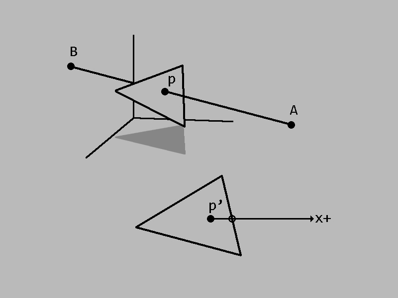

In [part 1 of this post](http://t3hz0r.com/post/guiltyspark-visibility-detection-part-1), I talked about reverse engineering and memory scanning, the problems with GuiltySpark's existing target visibility detection, and how those problems might be solved by performing ray casting in the map's binary space partitioning tree (BSP). This post will cover some of my notes from March 13th 2011, when I had just finished implementing it.

## Extraction
There were a few details of Halo's BSP that had me pull my hair out. For example, BSP trees are supposed to recursively subdivide the space into two halves. Halo's BSP nodes have indices for the child nodes on the front and back side of the dividing planes, but sometimes these indices were `-1`. It took me a while to figure out, but I believe this has to do with how Halo generates its BSPs in the first place.

To keep BSP generation quick, I think the developers chose to have an arbitrary polygon within the space define the dividing plane. Otherwise they would need some heuristic that determined which plane would roughly divide the surfaces in half. As a result, sometimes it could pick a polygon at the outside surface that didn't even divide the surfaces. In this case, the empty side would simply be assigned a child index of `-1`. From what I found, this happens rarely.

Another gotcha was the use of high order bits as flags. As I mentioned above, Halo doesn't use pointers to refer to front and back BSP nodes. It used indices, and you had to look up the node in an [array at a known memory location](bspmemory.jpg). If the index had its highest bit set (`0x80000000`), then the index instead referred to a location in the leaves array instead of the nodes array.

Sometimes you just don't figure out what a flag means, so you ignore it. Flagged plane indices in surfaces were causing causing an out of bounds error when accessing my planes array. I wasn't sure what a flagged plane index meant, but flipping the bit back to 0 didn't seem to have a negative effect, and the algorithm worked as expected. Flagged planes were also rare anyway.

Here's an excerpt from GuiltySpark showing how the BSP node **array** would be read out of memory once its location and size was known:

```cs
//extract `count` bsp nodes starting at address `pointer`
private void BSPGet_BSP3D_NODES(int count, int pointer) {
  int size = 0x0C; //the size of each node
  bsp3d_nodes = new Structures.BSP3D_NODE[count];

  //create a buffer to hold each node
  byte[] buf = new byte[size];

  for (int i = 0; i < count; i++) {
    int elementPointer = pointer + i * size;
    //read the node from memory at `elementPointer` into the buffer
    ReadMemoryNoBuf(elementPointer, size, ref buf);

    //populate our data structure
    bsp3d_nodes[i].planeIndex = (uint)System.BitConverter.ToUInt32(buf, 0x00);
    bsp3d_nodes[i].backNodeIndex_f = (uint)System.BitConverter.ToUInt32(buf, 0x04);
    bsp3d_nodes[i].frontNodeIndex_f = (uint)System.BitConverter.ToUInt32(buf, 0x08);
  }

  //... use bsp3d_nodes
}
```

A nice surprise was that the whole BSP extraction was fast--a blink of the eye. Theoretically, I could have implemented the tree traversal on Halo's in-memory BSP without extracting it to my own data structures. However, I thought that this might incur a performance overhead when I was repeatedly performing ray casting, plus I wanted to use it to [generate a navigation mesh](/post/guiltyspark-navigation) (which I never implemented). The actual calculations for the ray intersection are fast too.

## Occlusion Testing

When we've found a node where the dividing plane is between the bot and its target, we can't eliminate any more potential occluding surfaces and we have to start doing triangle-ray intersection tests on the convex surfaces in the leaves below the node.

```cs
//check if surfaces in BSP node index `node` occlude the ray between points `a` and `b`
private bool BSP3D_IntersectionCheck(uint node, Structures.FLOAT3 a, Structures.FLOAT3 b) {
  //if the node index is flagged, then this is a leaf and check bsp2d refs
  if ((node & 0x80000000) != 0) {
    //sometimes halo's choice of BSP planes fails to divide the space
    //-1 means the surface does not exist
    if ((int)node == -1)
      return false;

    uint leaf = node ^ 0x80000000;
    uint bsp2d_count = leaves[leaf].BSP2DReferenceCount;
    uint bsp2d_firstIndex = leaves[leaf].firstBSP2DReferenceIndex;

    //halo uses a "2D BSP" for its leaves, and I don't know what for
    //it's still fast to loop over the surfaces in each leaf
    for (uint i = bsp2d_firstIndex; i < bsp2d_firstIndex + bsp2d_count; i++) {
      if (BSP2D_IntersectionCheck(bsp2d_refs[i].BSP2DNodeIndex_f, a, b))
        return true;
    }

    return false;
  }

  //otherwise, the node is not a leaf so check the child nodes
  return BSP3D_IntersectionCheck(bsp3d_nodes[node].backNodeIndex_f, a, b) ||
    BSP3D_IntersectionCheck(bsp3d_nodes[node].frontNodeIndex_f, a, b);
}
```

To calculate if the ray intersects a polygon, find the point of intersection between the ray and the polygon’s plane. Then project the polygon and the intersection point into 2D based on the dominant component of the plane’s normal, which ensures the polygon has nonzero area and avoids thin polygons prone to rounding error. Next, I apply the [Jordan curve theorem](http://en.wikipedia.org/wiki/Jordan_curve_theorem): if an arbitrary ray from the intersection point crosses an even number of the polygon’s edges, the intersection point lies outside the polygon.



## Results
The algorithm worked really well in practice. The bot now knew, without a doubt, if the target was occluded by level geometry or not. The only flaw is that it didn't test for intersection with objects in the map, which aren't a part of the BSP tree. These include things like vehicles, trees and boulders. Most of the time this wasn't a problem, and the results were still far more reliable than the old method of testing the opacity of a UI element.

In this video, the blue line represents the ray between the bot and the target. Red polygons show surfaces that block the ray.
<iframe width="560" height="315" src="//www.youtube.com/embed/2UxXhVOmczY" frameborder="0" allowfullscreen></iframe>