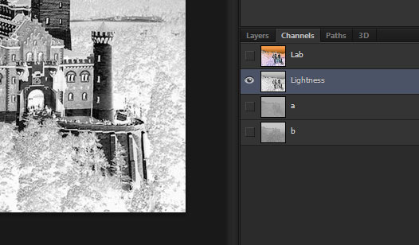
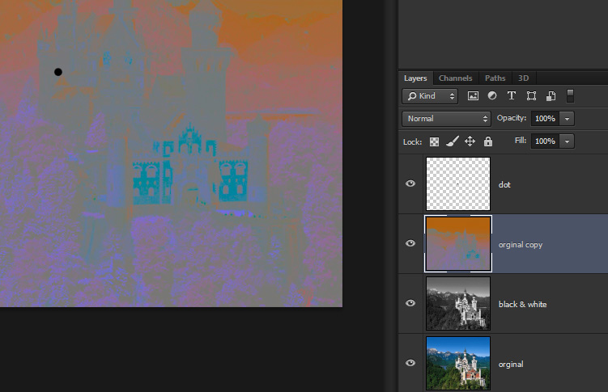
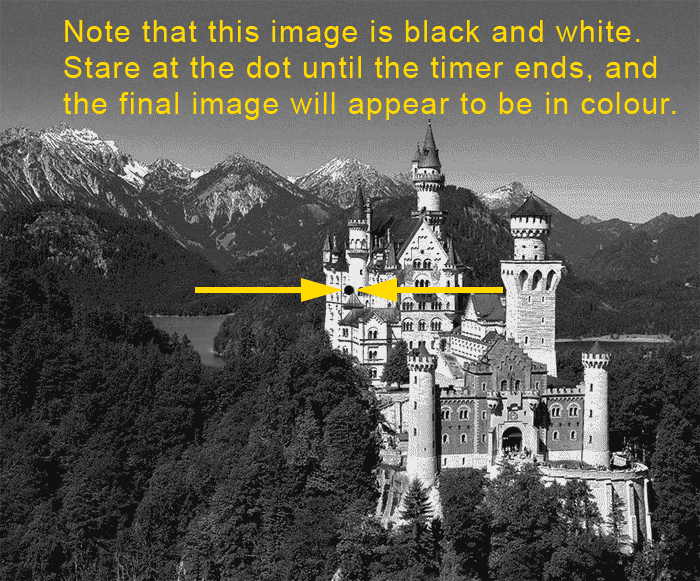

You've probably seen GIFs like this before. Just stare at the dot as the number counts down and the final image will look coloured despite actually being black and white.

The effect works by fatiguing colour receptors in your eye. This normally allows our eyes to compensate for different lighting conditions. When the image returns to black and white, your vision has compensated to "ignore" the colours in the previous image because those receptors are fatigued. The result is that you perceive the opposite colour in those areas of your vision.

Making these images is therefore pretty simple in theory. We just need a way to extract the opposite colour of an image independent of its lightness. This is easy to do in photoshop.

First, make sure you're in [RGB mode](rgb.jpg). Duplicate the source layer and invert the copy (Ctrl+I):

I also added a dot layer for the viewer to look at. Next we're going to switch to the Lab colour mode using this menu:

When it prompts you to merge layers, click **Don't Merge**. With the inverted layer selected (the one named "original copy"), switch to the channels window and select the Lightness channel.

What we're going to do now is clear the lightness information for this layer. This is done by filling its Lightness channel with 50% gray. With the Lightness channel selected, select **Edit > Fill** and for Contents, use **50% Gray**. Leave blending on the default settings (Normal, 100%). Now we can switch back to the RGB colour mode and back to the Layers window. Duplicate the original layer and desaturate it (Ctrl+Shift+U).

At this point we're pretty much done. You can test the effect out by staring at the dot then toggling off the visiblity of the colour layer. Here's a lazy Google result for [making a GIF out of the layers](https://www.google.ca/search?q=photoshop+gif+from+layers&oq=photoshop+gif+from+layers).

Experiment with the timing. You'll want at least 10 seconds, but sometimes these things tell you to stare at the dot for up to a minute. I've found that increasing the saturation of the colour layer may help increase the effect.