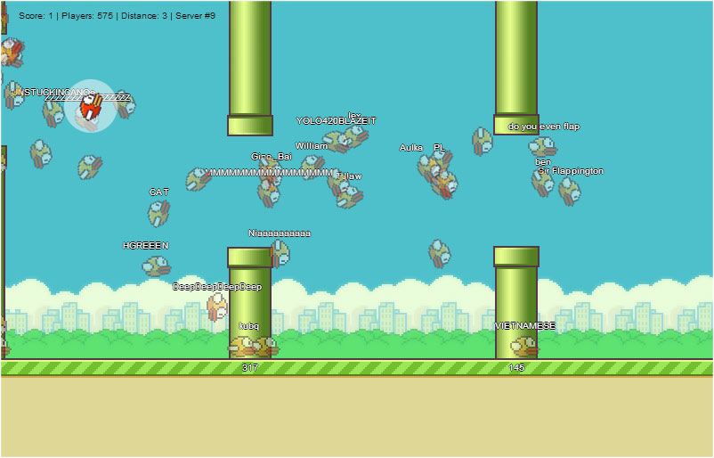

In the wake of mobile game Flappy Bird's popularity came an even funner browser variant called [FlapMMO](http://flapmmo.com/) ([@FlapMMO](https://twitter.com/FlapMMO)). The great thing about FlapMMO is being able to see the attempts of thousands of other players. Even though there's no interaction between the birds, it's still a hilarious competition.



When FlapMMO was first put online, I started digging into the page source to see how it worked. The javascript was  obfuscated, but some parts of it stood out, though:

```js
window.onload = function () {
  //...
  setInterval(H, 1E3 / 60);
  setInterval(N, 50)
};
```

It's calling `H` 60 times per second (likely some kind of frame update), and `N` every 50 ms. `H` looks like it instructs all birds to `think()`, and `N` looks like its sending an XY coordinate over a websocket. So it seems that the game trusts the client to send the bird's position every 50 ms. The server then relays these coordinates to all other players in the server. There are multiple servers to balance the load, and only players in the same server can see each other.

So if the client is trusted to report the bird's coordinates to other players, how is the bird's motion calculated? This is the prototype of a bird and the `think()` function is the key to its motion:

```js
F.prototype = {
  id: 0,
  x: 0,
  y: 0,
  vx: 0,
  vy: 0,
  seed: 0,
  wasSeen: !0,
  nick: null,
  ...
  draw: function () {
    ...
  },
  think: function () {
    if (this == c) {
      for (var a = 0; a < n.length; a++)
        if (n[a].collidesWith(this)) {
          t = !0;
          break
        }
      this.vy += 0.4;
      389 <= this.y && (this.vy = this.vx = 0, t = !0);
      t ? (this.vx = 0, 389 < this.y && (this.y = 389)) : B && (B = !1, this.vy = -8);
      this.x += this.vx;
      this.y += this.vy;
      this.targetRotation = Math.atan2(this.vy, this.vx)
    } else
      a = (p - this.start) / (this.end - this.start),
      1 < a && (a = 1),
      this.x = this.sx + (this.fx - this.sx) * a,
      this.y = this.sy + (this.fy - this.sy) * a,
      this.targetRotation = Math.atan2(this.fy - this.sy, this.fx - this.sx);
    for (; 180 < this.targetRotation;) this.targetRotation -= 360;
    for (; - 180 > this.targetRotation;) this.targetRotation += 360;
    this.rotation = (this.rotation + this.targetRotation) / 2
  },
  //...
};
```

From other parts of the code it was clear that `c` represents the player's own bird. If `this == c`, then the game simulates the bird physics. Else, it linearly interpolates other players positions between their last point and their current point. This was obvious when watching other players birds move because they didn't follow smooth hopping paths and could pause in position waiting for the next point to arrive over the socket. Implementing my own bird motion was simply a matter of using Chrome's debugger to set a breakpoint within the context of think() and overwrite the prototype, as well as add some extra features:

```js
mybrake = true;

d.addEventListener("mousemove", function(evt) {
  var rect = d.getBoundingClientRect();
  mymousex = evt.clientX - rect.left,
  mymousey = evt.clientY - rect.top
});

d.addEventListener("mousedown", function(evt) {
  mybrake = !mybrake;
});

this.__proto__.think = function () {
  if (this == c) {
    this.vy = 0;
    this.vx = 0;
    if (!mybrake) {
      this.x += (mymousex - 381) * 0.1;
      this.y += (mymousey - 257) * 0.1;
    }
    this.targetRotation = Math.atan2(this.vy, this.vx)
  } else
    a = (p - this.start) / (this.end - this.start),
    1 < a && (a = 1),
    this.x = this.sx + (this.fx - this.sx) * a,
    this.y = this.sy + (this.fy - this.sy) * a,
    this.targetRotation = Math.atan2(this.fy - this.sy, this.fx - this.sx);
  for (; 180 < this.targetRotation;) this.targetRotation -= 360;
  for (; - 180 > this.targetRotation;) this.targetRotation += 360;
  this.rotation = (this.rotation + this.targetRotation) / 2
}
```

After resuming the game, respawning caused my bird to be created from the prototype and inherit the new `think()` function. I could now use my mouse to fly the bird around and click to toggle a hover in place mode:


Other players could indeed see this, and I noticed a few other "experimenters" doing similar things like flying in slow motion, backwards, or hovering in place. Unfortunately, the game was taken down by DDoSers that night. By the next morning the developer had implemented a new method of communicating player positions that works very well in improving motion, decreasing traffic, and preventing exploits like this. This lead to another opportunity for some data gathering though, which you can [read about here](/post/analysis-flapmmo-attempts).