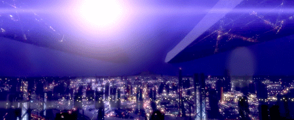
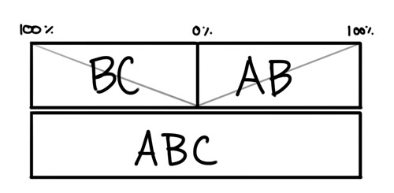

I recently came across [a question in r/photoshop](http://www.reddit.com/r/photoshop/comments/1yboew/how_do_i_loop_this_slightly_complex_gif_in/) about how to make this Mass Effect GIF loop smoothly (~10s long):

At first I didn't know how to do it and suggested some Microsoft Research tools ([Cliplets](http://research.microsoft.com/en-us/um/redmond/projects/clipletsdesktop/) and [VideoLoops](http://research.microsoft.com/en-us/downloads/d02f3198-7896-45eb-89e8-5a75859b67c8/)), but I still wanted to come up with a way to do it in Photoshop.

## The goal
We need to find a way to make the start and end of the GIF the same with believable transitions in between. You could blended the first frame 50% into the final frame, but that only works well for GIFs with rapid, high frequency changes like fire and noise.

Another way is to blend over a longer period with a gradual fade out. Imagine the clip can be represented as [ABC], where A is the start of the clip, B is the middle, and C is the end. We can duplicate the source clip, split it at the middle to get [AB][BC], and rearrange the halves to get [BC][AB]. Now the start and end of the clip match up perfectly, and we just need to work on smoothly transitioning C to A. Since we still have [ABC] on a layer below, we can fade out [BC] over the first half of the whole clip and fade in [AB] over the second half:

The way you fade in/out a clip doesn't necessarily need to be opacity. Opacity is the simplest way about it (crossfade), but in this case I don't think it would produce a desirable effect because all the moving lights would fade out together and be replaced with a different set of moving lights. An alternative that I think works well in this case is using moving masks to fade in/out the half-clips.

## Steps
To do this tutorial you'll need Photoshop CS6 or CC for the new video timeline. You should also be familiar with clipping masks and the concept of keyframing.

### 1. Open the source GIF and bring up the Timeline window
### 2. Convert the animation to video timeline

### 3. Select all layers and right click on them, click Convert to Smart Object. Name this smart object ABC
### 4. Duplicate ABC and line ABC Copy up with ABC. Cut ABC Copy in half, name the halves AB and BC.
To get the playhead at the middle, find out the length of the clip in frames and divide by 2. In this case, the clip was 3.11f long which means 3 seconds plus 11 frames, with 30 frames per second. That means the halfway point is at 1.20f. You can also go into the panel settings and change the time units from timecode to frame number.

### 5. Swap the positions of AB and BC
### 6. Create clipping masks for BC and AB. Fill these mask layers with any colour. Arrange like so:

What have we done here? Layers AB and BC are only visible where their clipping masks are visible, so if we animate the clipping masks then we can create a [wipe transition](http://www.youtube.com/watch?v=usXca7W_jvM). This is desirable because we can do the wipe in the direction the lights are moving and create a less noticeable transition.

### 7. Animate the masks
You can see in the above image where I've placed the keyframes. At the start of BC the mask should cover the image, but at the end of BC the mask should be moved entirely to the left. You can blur the right edge of the mask for a smoother wipe. Likewise, AB Mask should move in from the right so that AB is fully visible at the end of the clip. With BC fully visible at the start, AB fully visible at the end, and the half-clips fading in/out nicely with an animated mask, it should work like this:

I actually didn't animate the masks across the full width of the image since the moving lights end at a certain point.

### 8. You're done!

Just save for web now. Mine's faster than the source because I left the framerate high, but you can match the framerate to the original using the Timeline options. You can compare the result to the [crossfade method](crossfade_method.gif) instead of moving masks. It's a bit less work and you just need to set keyframes on the opacity of BC and AB, but you can definitely see lights fading out of existence more easily than the moving mask method.
