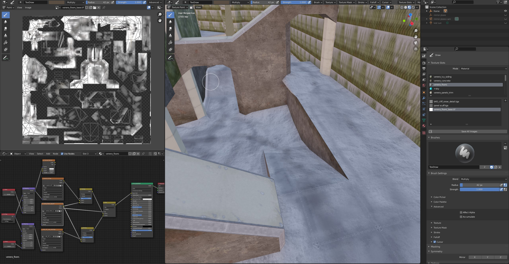
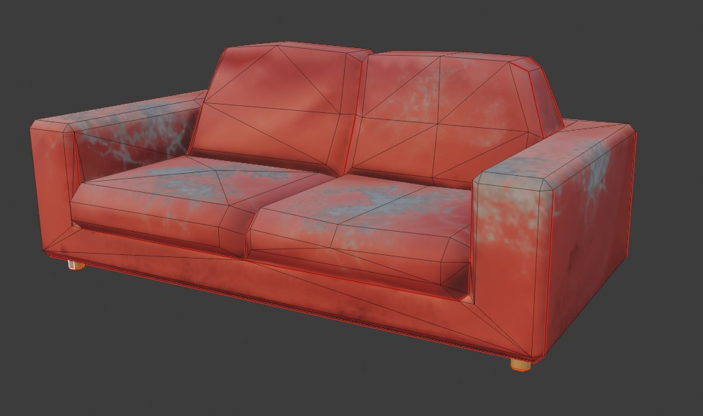
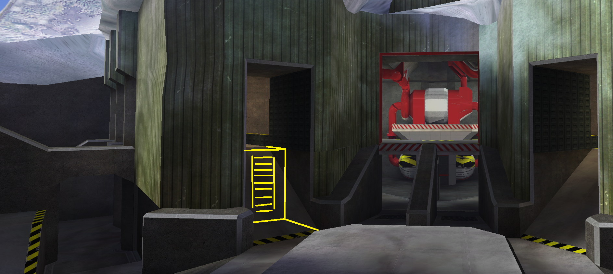

_[More screenshots below](#screenshots)_

_Cold Shoulder_ is a small, competitive-oriented, symmetric Halo Custom Edition map. It was created in collaboration with level designer [Blaze Lightcap](https://www.artstation.com/blazedillon) for the [CE Reclaimers](https://discord.reclaimers.net) season 1 [map contest](https://haloce3.com/map-contest/), in which it won 1st place. The map takes place at an old Russian geothermal plant somewhere on the Kamchatka peninsula.

## Download
_Cold Shoulder_ is open source. You can find sources and releases of its `.map` file here:

* https://github.com/csauve/cold-shoulder
* https://opencarnage.net/index.php?/topic/8224-cold-shoulder/
* https://t3hz0r-files.s3.amazonaws.com/halo/releases/cold-shoulder/cold_shoulder.7z

Also check out [Blaze's ArtStation post](https://www.artstation.com/artwork/18ZqP2) and launch video:

<iframe width="560" height="315" src="https://www.youtube-nocookie.com/embed/wNO1XfwGObw" frameborder="0" allow="accelerometer; autoplay; clipboard-write; encrypted-media; gyroscope; picture-in-picture" allowfullscreen></iframe>

Music credit to [Neo Te Aika](http://neoteaika.com/)!

## The making of _Cold Shoulder_
This map was built over the fall and winter of 2020, mainly after the completion of [_Alpine_](/projects/halo/alpine). The Halo CE Reclaimers Discord server and [CE3](https://haloce3.com/) was holding a custom map contest. _Cold Shoulder_ ended up being one of 7 entries.

### Prototyping

While I knew I wanted to join the contest, I didn't have any great ideas for a layout. The contest called for competitive-oriented maps but I wasn't confident in my ability to balance for 2v2. Luckily, Blaze was in the Discord server and was offering some of his Unreal-engine block-outs as starting points.

I brought one of these exports into Blender and started remodeling it as a manifold mesh rather than separate entities, but using the original block-out below as a guide for scale. It is necessary to model Halo CE levels this way because of how its collision BSP compiler works.

Unfortunately, while playing in a CE reclaimers gamenight on the very cursed map _[Desert Hog](https://www.youtube.com/watch?v=re4VWoTrAuQ)_, my graphics card decided to die and I was forced to limp along with a 9800 GTX in my system. This was pretty unstable in my Linux setup and I experienced frequent crashes and hard locks. Despite this, I managed to throw the level in-game and get a feel for scale.

My first impression was that it felt too small even though I used a [70 unit tall](https://c20.reclaimers.net/h1/guides/scale/) reference cube while modeling. It's hard to quantify exactly what the "right" scale is, but it's just a feeling that comes with years of playing. I scaled up the level a bit until it felt comfortable but not too big. Part of validating the scale is just running around the map and trying various jumps and shortcuts to see if they're fun, or if a small alteration could give skilled players a way to surprise their opponents through movement.

### Identity crisis
The map was originally called _Venera_ because I imagined it taking place on Venus. The layout immediately struck me as some kind of human industrial facility, and I wanted to pick an exotic location with unique sky colour. I had also recently watched some YouTube videos about geothermal energy in Iceland and the deep pits in this map made me think they could be wells for a geothermal power plant.

I started modeling in some pipes, boilers and heat exchangers, and a large generator on the central platform. The pipes and components actually follow proper cycles for brine and working fluids from [a diagram I found online](https://nrginitiative.files.wordpress.com/2014/04/ormat-combined-cycle-geothermal.jpg?w=502&h=342). I used other references of [USSR](https://russiatrek.org/blog/photos/the-first-geothermal-power-plant-in-the-ussr/) and [modern Russian](https://englishrussia.com/2014/05/22/russian-geothermal-power-stations/) geothermal plants for inspiration.

However, as time went on It became clear that the architectural style was very "old earth" rather than a supposedly advanced Venus colony. It clashed with attempts to add large backdrop structures like terraforming equipment or environment domes outside the map, and the shapes in the level lent themselves better to materials like concrete instead of angular metal panels often seen in Halo's human colony settings. It was also difficult to make the map look truly bone-chilling when Venus' atmosphere is a warm greenish-yellow.

I decided to change the map's name to _Boiling Point_ and move the setting to Earth. Now I could commit to a more naturally cold atmosphere, using concrete and other "old earth" materials, and adding details which made the facility feel unmaintained and worn-out. As you know from this post's title, the map was again renamed to _Cold Shoulder_ later on Blaze's suggestion.

### Art pass

Like with _Alpine_, I unwrapped a lot of ground space into a single texture sheet and packed the islands as close as I could. It was important to avoid overlap and bleeding in case I needed to [use the texture UV layout for lightmapping](https://c20.reclaimers.net/h1/tags/shader/#tag-field-shader-flags-simple-parameterization) later, since Halo's lightmapper sometimes produces less than desirable unwraps.

Painting the ground map was made easy using Blender's texture paint mode and a shader emulating Halo's [shader_environment tag](https://c20.reclaimers.net/h1/tags/shader/shader_environment/). The alpha channel of the base map controls the blend between the tiling detail maps, so I could paint where I wanted snow and where I wanted the metal flooring beneath to show through.

I also used this tool to paint basic foot paths into the RGB channels and ensure that paths were continuous as they passed from one UV island to the next. Later, I brought the base map into Krita for its more powerful brushes and further detailed the texture. A similar process was used on the green exterior metal siding of the power plant; it's a large blend map where I've painted ice on upper edges of the panels and windward sides.

I can't remember why it became a thing, but then Fleetwire insisted this map have a couch somewhere and I of course had to indulge the guy. I was already rushing to complete the map in time for the contest, but I needed a change from the type of work I was doing and ended up modeling a low-poly couch. I then sculpted it so I could bake some AO and lighting into a diffuse map (CE doesn't support normal maps on scenery objects) because I wasn't confident I could paint convincing folds in the faux-leather.

Although the layout is symmetric, there are plenty of asymmetric details like missing exterior panels, burnt out lights, and the colour of pipes and wall paint. This helps remind players which side of the map they're on. For instance, red team's side uses warmer orange lighting while blue team's uses more clean white lights.

I won't detail all the steps that remained in the art pass, but they included:

* Adding catenary cables hanging between exterior lights
* Adding electrical conduits to interior walls which connect all the lights
* Placing scenery objects
* Adjusting weather system, wind, and weather polyhedra
* Modeling a simple custom skybox
* Setting up sound environments and sound scenery
* Adding Russian wall decals

### Gameplay iteration
Because the map wasn't supposed to be played until the contest gamenight, this made playtesting hard. I trusted Blaze's level design judgement and incorporated changes he suggested, such as adding death pits at the back of the stairwells, converting some ramps to ladders, and placing items:

---

<h2 id="screenshots">Completed map</h2>

Thankfully, I completed the map a few hours before the deadline. I spent as much time as I could adding finishing touches and running high quality lightmaps. I'm very happy with the results, and it played well during the contest gamenight. Although the level had been designed for low player counts, we had over a dozen players in the level and it didn't feel too chaotic. I attribute this to how sight lines are consistently blocked over longer distances, leading to encounters being more manageable.

If I were to release a version 2, I would:

* Reduce the sniper respawn time. The default spawn timer and fact that players drop when around the map when they die means the weapon is a bit _too_ available.
* Increase the size of King of the Hill mode hill zones. There's not much room to maneuver in them to avoid grenades.

